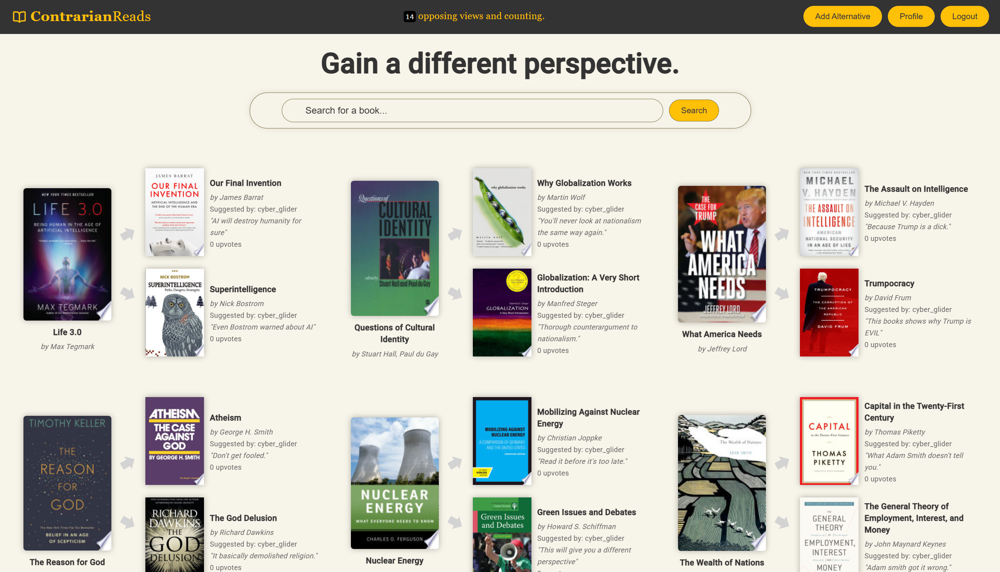
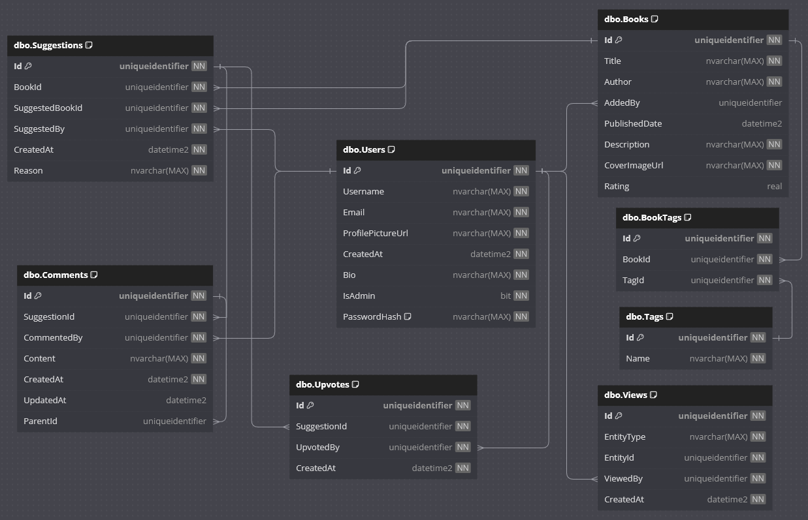

# 📖 ContrarianReads (Frontend repo)

ContrarianReads is a crowdsourced platform that helps readers explore diverse perspectives through element recommendations. When users input a non-fiction element, the platform generates recommendations for other non-fiction works that present *opposing viewpoints* or alternative arguments. Community members can submit element booksWithSuggestions and vote on recommendations, helping surface the most relevant counterpoint books for each title.

The platform is designed to combat the ["filter bubble"](https://www.wikiwand.com/en/articles/Filter_bubble) effect—where algorithms and personal choices limit exposure to differing viewpoints—by actively encouraging readers to explore perspectives that challenge their existing beliefs. By facilitating access to well-reasoned opposing arguments, ContrarianReads helps users broaden their intellectual horizons and develop a more nuanced understanding of complex topics.

<figure>
  
  <figcaption>Main screen</figcaption>
</figure>

<figure>
  
  <figcaption>Database ERD diagram</figcaption>
</figure>

# 🌐 Live demo

Work in progress. Will be soon available online.

# 🚦 Deploy status

Work in progress. Will be soon available online.

# 🛠️ Technologies used

## 🎨 Frontend

- Built with **Angular** and styled using **Angular Material**
- Allows logged-in users to search for books, submit, upvote and comment alternative recommendations
- Secure login and register system implementing **JWT authentication**
- Route guards to prevent address tampering
- UserRetrieve profile and user activity dashboard
- Alternative element recommendations based on user activity
- Hosted on **Netlify**

## ⚙️ Backend

- Find the backend repo [here](https://github.com/dividedby-0/contrarian-reads-backend)
- Developed with **C#**, **.NET Core** and **ASP.NET Core**
- Service-based architecture with DTOs for data transfer
- Uses **AutoMapper** for data mapping
- Provides secure APIs for authentication using **JWT**
- Books/recommendations/comments/upvotes management through secure RESTful endpoints
- Password encryption using **BCrypt**
- Strict input validation and rate limiting for login attempts
- Global exception handling middleware
- Data stored in **Microsoft SQL Server** database
- Backend and database hosted on **Microsoft Azure**

# 🚀 Future plans

- [ ] (WIP)

# 📝 License

This project is licensed under the [MIT License](https://github.com/dividedby-0/contrarian-reads-frontend/blob/main/LICENSE). Logos from [SVGRepo](https://www.svgrepo.com/).

## 🤝 Contributing

While this is primarily a personal project, bug reports and feature booksWithSuggestions are welcome in the issues section.
